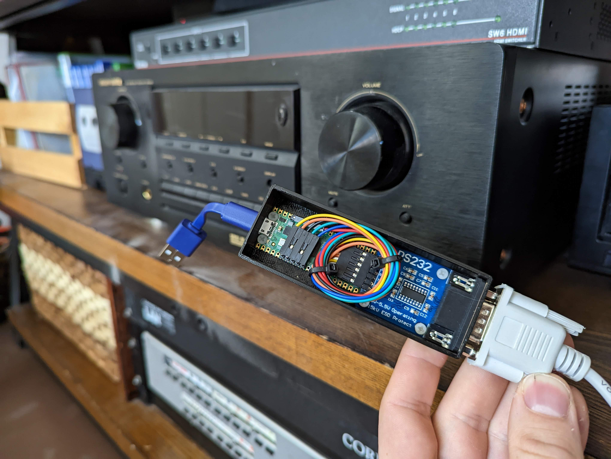

# ESPHome Marantz RS232 Device
Control a Marantz audio receiver wirelessly with an ESP or Pico W device via RS-232C utilizing ESPHome. This program is currently optimized for operation of the Marantz SR6400/SR5400.

## Compatible Hardware
To use this software, you must utilize a UART to RS-232 TTL level converter. *Do not connect your microcontroller directly to RS-232!* Also ensure that your level converter is 3.3v compatible. Here are a number of boards that should be compatible with minor adjustments:
* [Waveshare RS232 Board](http://www.waveshare.com/wiki/RS232_Board)
* [SparkFun RS232 Shifter - SMD](https://www.sparkfun.com/products/449) - _Doesn't support CTS/RTS_
* [Waveshare Pico-2CH-RS232](https://www.waveshare.com/wiki/Pico-2CH-RS232) - _Doesn't support CTS/RTS, (specifically designed for Pico W)_

If you're feeling particularly handy, you can also build one yourself using an MAX3232/SP3232 IC.

## ESPHome Setup
You will need a working instance of ESPHome on your local network that your device can communicate with. I recommend setting up [Home Assistant](https://www.home-assistant.io/) on a [Raspberry Pi](https://www.home-assistant.io/installation/raspberrypi/) with the [ESPHome integration](https://www.home-assistant.io/integrations/esphome/), but there are many other options available. See the [ESPHome website](https://esphome.io/) for more information.

## Device Setup
Configuring your IoT device will differ if you choose to do a [Home Assistant](https://esphome.io/guides/getting_started_hassio.html) or [command line](https://esphome.io/guides/getting_started_command_line.html) install. I recommend testing your device with a basic program and enabling Over the Air (OTA) updates to make changing your device configuration very easy.

The initial firmware flashing process will vary depending on your microcontroller. Follow the instructions on the previous links on how to do so.

## Device Configuration
You should be able to easily copy and paste the YAML configuration file, [marantz.yaml](marantz.yaml), into your device's configuration (within Home Assistant -> ESPHome, hit the "Edit" button for your device).

You may want to copy the initially generated API encryption key and OTA password and insert them into your secrets.yaml file with the specified keys: `marantz_api_encryption` and `marantz_ota_password`. You can also set up the wifi fallback hotspot using the specified keys: `marantz_ap_ssid` and `marantz_ap_password`.

After you've finished configuring your device within ESPHome, recompile and update your device's firmware (I recommend wirelessly using OTA).

### GPIO
The default configuration is set up for the [Raspberry Pi Pico W](https://datasheets.raspberrypi.com/picow/PicoW-A4-Pinout.pdf) and uses the onboard LED to indicate UART command delivery and UART1 on pins 4 and 5. You may want to adjust these settings depending on your device.

## Controls
A power toggle switch and volume up and down buttons show now appear on your Home Assistant dashboard (if you chose this approach) after adding your ESPHome device under Settings -> Integrations.

I recommend using the control of your audio receiver in automations. _Ie: turn the audio receiver on/off when your smart TV power state is changed._

## Debugging
It is highly recommended that you inspect your device's log on ESPHome to ensure that it is responding to your dashboard controls and sending the appropriate UART messages to your audio receiver.

To ensure that your RS232C device is working properly, it may be helpful to utilize a USB-to-RS232 dongle connected to your computer and viewing the incoming data on a serial monitor. Make sure that the dongle's settings match the your device's UART settings (as defined in your device configuration).

## 3D Printed Case
The design and STL files are provided for a basic 3D printed case that is specifically designed for the [Raspberry Pi Pico W](https://www.raspberrypi.com/documentation/microcontrollers/raspberry-pi-pico.html) and [Waveshare RS232 Board](http://www.waveshare.com/wiki/RS232_Board). The top lid snap fits to the bottom base and provides access to the micro USB power input and RS232 output.

## Notes
* You can easily expand the controls to issue more commands to your receiver (such as input selection). See [UART Bus](https://esphome.io/components/uart.html) and [UART Switch](https://esphome.io/components/switch/uart.html) for more details. Full device command list is available in the [provided documentation](docs/SR6400_SR5400_RS-232C_Specification_V100b.pdf).
* The current device configuration is fairly simple and doesn't process device response messages. Functionality could be expanded by implementing status calls and acknowledge responses to better indicate power status, volume, etc and ensure that commands are executed successfully.
* Sometimes UART messages are not received properly if they are issued too quickly. Because of this, a delayed repeat is implemented on the power switch actions.
